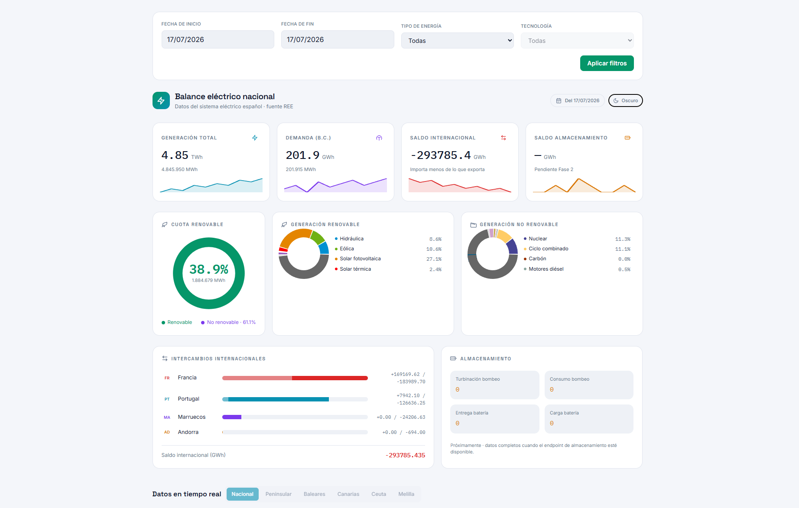

# Ree View — Balance Eléctrico Nacional

Visualizador fullstack del **balance eléctrico del sistema eléctrico nacional español**, alimentado en tiempo real por la API pública de [REE (Red Eléctrica de España)](https://apidatos.ree.es/).

Permite explorar **generación por tecnología**, **demanda**, **intercambios internacionales en fronteras** y **balance de almacenamiento**, filtrando por **rango de fechas** y **tipo de energía** (renovable vs. no-renovable).

<p align="center">
  
  
  
  
  
  
  
  
  
  
  
</p>



---

## 🧱 Stack

### Frontend (`frontend/`)
- **React 19** + **Vite 6**
- **TypeScript**
- **Apollo Client** (GraphQL)
- **Tailwind CSS 4** + **recharts** (gráficos)
- **react-datepicker**

### Backend (`backend/`)
- **NestJS 10** + **GraphQL (Apollo Server)**
- **Mongoose** + **MongoDB 6.0** (caché de respuestas REE)
- **Axios** (cliente HTTP a REE)
- **@nestjs/throttler** (rate-limiting)
- **class-validator** + **class-transformer** (validación de inputs)

### Infraestructura
- **Docker Compose** con 3 servicios: `backend`, `frontend`, `mongo`
- **Nginx** en el contenedor del frontend (sirve el build estático de Vite)

---

## 🏃 Desarrollo local (sin Docker)

### Requisitos
- **Node.js** ≥ 20
- **pnpm** ≥ 10
- MongoDB local en el puerto `27017` (o cualquier URI configurable vía `.env`)

### 1. Backend
```bash
cd backend
cp .env.example .env       # ajusta REE_API_URL, MONGODB_URI, CORS_ORIGINS...
pnpm install
pnpm run dev               # http://localhost:3000/graphql
```

### 2. Frontend
```bash
cd frontend
cp .env.example .env       # VITE_API_URL=http://localhost:3000/graphql
pnpm install
pnpm run dev               # http://localhost:5173
```

Abre `http://localhost:5173` y selecciona un rango de fechas para empezar a explorar datos.

---

## 🐳 Despliegue con Docker

Levanta los tres servicios (backend + frontend + Mongo) en un solo comando:

```bash
# Desde la raíz del proyecto
docker-compose up -d --build
```

| Servicio  | URL                          | Notas                                  |
|-----------|------------------------------|----------------------------------------|
| Frontend  | http://localhost:80          | Servido por Nginx                      |
| Backend   | http://localhost:3000/graphql | GraphQL Playground disponible         |
| MongoDB   | `mongodb://localhost:27017`  | DB `energy-balance`, volumen persistente |

### Variables de entorno relevantes
- `CORS_ORIGINS` — whitelist de orígenes permitidos (separados por coma)
- `MONGODB_URI` — conexión a Mongo (por defecto usa el contenedor `mongo`)
- `THROTTLE_TTL_MS` / `THROTTLE_LIMIT` — rate-limit global del GraphQL
- `VITE_API_URL` — endpoint que consumirá el frontend (injected at build time)

### Verificación end-to-end

Tras levantar el stack, ejecuta el script de smoke test:

```bash
chmod +x verify-stack.sh
./verify-stack.sh
```

Pasa por las **6 fases** críticas: stack-up, los 3 resolvers GraphQL, rate-limiting y TTL en MongoDB.

### Comandos útiles
```bash
docker-compose ps                  # estado de los servicios
docker-compose logs -f backend     # logs en vivo
docker-compose down                # detener todo
docker-compose down -v             # detener + borrar volumen de Mongo
```

---

## 🗂️ Estructura del proyecto

```
ree-view/
├── backend/                # NestJS + GraphQL + Mongo
│   ├── src/energy-balance/ # Módulo principal del dominio
│   └── test/              # Tests (Jest + Vitest)
├── frontend/               # React + Vite + Apollo
│   └── src/components/    # Cards: generación, demanda, fronteras, storage
├── docker-compose.yml      # Stack completo (backend + frontend + mongo)
├── verify-stack.sh         # Smoke test automatizado (6 fases)
└── reporte.md              # Auditoría inicial del proyecto
└── reporte-post-stack.md   # Verificación final del stack
```

---

## 🧪 Tests

```bash
# Backend (Jest + Vitest)
cd backend
pnpm run test           # Jest: smoke tests + integración
pnpm run test:vitest    # Vitest: ReeClientService (happy + error paths)
pnpm run test:all       # todo junto

# Frontend (Vitest)
cd frontend
pnpm run test:vitest
```

---

## 📐 Características principales

- 🗓️ **Filtros**: rango de fechas, grupo energético (renovable/no-renovable) y tipo de energía.
- 📊 **Generación**: desglose por tecnología (eólica, solar, hidráulica, nuclear, gas, etc.) con totales y porcentajes.
- ⚡ **Demanda**: demanda promedio del sistema.
- 🌍 **Fronteras**: intercambios internacionales con Portugal, Francia, Andorra y Marruecos.
- 💾 **Almacenamiento**: balance de almacenamiento (bombeo y baterías).
- 🌓 **Tema claro/oscuro** con soporte nativo vía design tokens.
- 🚦 **Resiliencia**: rate-limiting, validación de fechas, caché TTL de 24h en Mongo, fallback mock en dev.

---

*Hecho con fines educativos/demostrativos sobre la API pública de REE. No afiliado a Red Eléctrica de España.*
